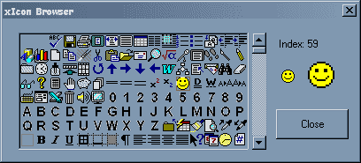



## CBX Icon Browser

### Description

VB does not have an icon browser to browse through all the build in office icons. So I made one. Simply scroll through the list then select the icon you wish to use. The icons index will apear as well as a 16x16 and a 32x32 preview of the selected icon. The source is not commented very good.
 
### More Info
 

             |
---                |---
**Submitted On**   |2001-02-02 16:42:50
**By**             |[Dean Lunz](https://github.com/Planet-Source-Code/PSCIndex/blob/master/ByAuthor/dean-lunz.md)
**Level**          |Intermediate
**User Rating**    |4.8 (19 globes from 4 users)
**Compatibility**  |VB 5\.0, VB 6\.0
**Category**       |[VB function enhancement](https://github.com/Planet-Source-Code/PSCIndex/blob/master/ByCategory/vb-function-enhancement__1-25.md)
**World**          |[Visual Basic](https://github.com/Planet-Source-Code/PSCIndex/blob/master/ByWorld/visual-basic.md)
**Archive File**   |[CODE\_UPLOAD14671282001\.zip](https://github.com/Planet-Source-Code/dean-lunz-cbx-icon-browser__1-15107/archive/master.zip)

